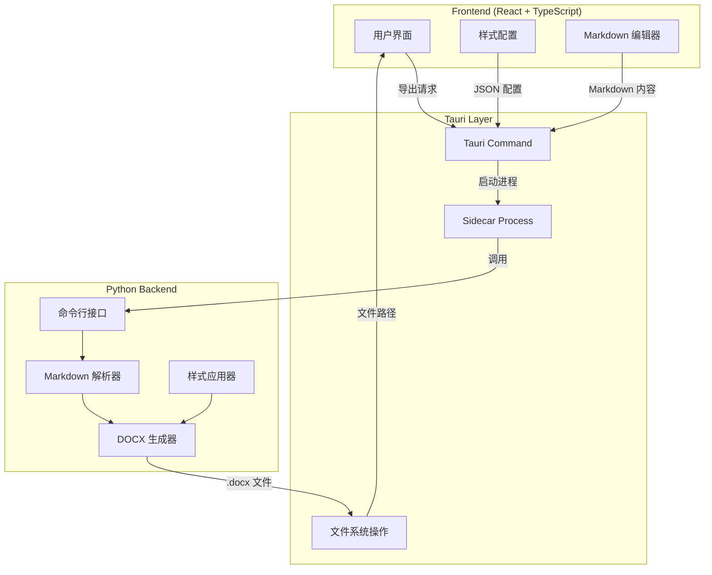

# Design Document: Python Backend Upgrade

## Overview

本设计文档描述将 Markdown to Word 应用的文档生成功能从前端 TypeScript (docx.js) 迁移到 Python 后端 (python-docx) 的技术方案。升级后，Tauri 应用将通过 sidecar 机制调用打包好的 Python 可执行文件来生成 Word 文档。

## Architecture



## Components and Interfaces

### 1. Python Backend CLI (`backend/backend.py`)

现有的 Python 后端已实现基本功能，需要扩展以支持更多 Markdown 元素。

**命令行接口：**
```bash
python backend.py --input <markdown_file> --output <docx_file> [--config <json_string>] [--config-file <json_file>]
```

**输入参数：**
| 参数 | 类型 | 必需 | 描述 |
|------|------|------|------|
| `--input`, `-i` | string | 是 | 输入 Markdown 文件路径 |
| `--output`, `-o` | string | 是 | 输出 DOCX 文件路径 |
| `--config`, `-c` | string | 否 | JSON 格式的样式配置 |
| `--config-file`, `-f` | string | 否 | JSON 配置文件路径 |

**输出：**
- 成功：退出码 0，生成 DOCX 文件
- 失败：退出码非 0，stderr 输出错误信息

### 2. Frontend Service (`services/pythonBackend.ts`)

新增服务模块，封装与 Python 后端的交互逻辑。

```typescript
interface ExportOptions {
  markdown: string;
  outputPath: string;
  config: DocumentConfig;
}

interface ExportResult {
  success: boolean;
  filePath?: string;
  error?: string;
}

async function exportWithPython(options: ExportOptions): Promise<ExportResult>;
```

### 3. Style Configuration Interface

样式配置 JSON 结构（已在 `interfaces/Config.ts` 定义）：

```typescript
interface DocumentConfig {
  global: {
    pageMargin: number;
    baseFontCn: string;
    baseFontEn: string;
  };
  styles: {
    h1: StyleConfig;
    h2: StyleConfig;
    h3: StyleConfig;
    body: StyleConfig;
    code: StyleConfig;
    quote: StyleConfig;
  };
}

interface StyleConfig {
  fontSize: number;
  color: string;
  bold: boolean;
  italic: boolean;
  lineSpacing: number;
  spaceBefore: number;
  spaceAfter: number;
  alignment: 'left' | 'center' | 'right' | 'justify';
  firstLineIndent: number;
  fontFamily?: string;
}
```

## Data Models

### Markdown AST 节点类型

Python 后端需要处理的 Markdown 元素：

| 元素类型 | Markdown 语法 | Word 映射 |
|----------|---------------|-----------|
| Heading | `# ~ ######` | Heading 1-6 样式 |
| Paragraph | 普通文本 | Normal 段落 |
| Code Block | ` ``` ` | 等宽字体段落 |
| Blockquote | `>` | 斜体 + 左缩进 |
| Ordered List | `1.` | List Number 样式 |
| Unordered List | `-` | List Bullet 样式 |
| Table | GFM 表格 | Word 表格 |
| Bold | `**text**` | 粗体 Run |
| Italic | `*text*` | 斜体 Run |
| Inline Code | `` `code` `` | 等宽字体 Run |
| Link | `[text](url)` | 超链接 |

### 错误类型

```python
class ConversionError(Exception):
    """Markdown 转换错误"""
    pass

class FileError(Exception):
    """文件操作错误"""
    pass

class ConfigError(Exception):
    """配置解析错误"""
    pass
```


## Correctness Properties

*A property is a characteristic or behavior that should hold true across all valid executions of a system-essentially, a formal statement about what the system should do. Properties serve as the bridge between human-readable specifications and machine-verifiable correctness guarantees.*

Based on the acceptance criteria analysis, the following correctness properties must be validated:

### Property 1: Document Generation Completeness
*For any* valid Markdown content, when passed to the Python_Backend, the backend SHALL produce a valid .docx file that can be opened by Word processors.
**Validates: Requirements 1.2**

### Property 2: Style Config Serialization Round Trip
*For any* valid DocumentConfig object, serializing to JSON and deserializing back SHALL produce an equivalent configuration object.
**Validates: Requirements 2.1**

### Property 3: Style Application Consistency
*For any* Style_Config with font, color, spacing, and alignment settings, the Python_Backend SHALL apply all specified styles to the corresponding elements in the generated document.
**Validates: Requirements 2.2, 2.3, 2.4**

### Property 4: Heading Level Preservation
*For any* Markdown content containing headings (h1-h6), the Python_Backend SHALL convert each heading to a Word paragraph with the corresponding heading level style applied.
**Validates: Requirements 3.1**

### Property 5: Code Block Formatting
*For any* Markdown content containing code blocks, the Python_Backend SHALL render each code block with monospace font (Courier New) and preserve line breaks within the block.
**Validates: Requirements 3.2**

### Property 6: Blockquote Styling
*For any* Markdown content containing blockquotes, the Python_Backend SHALL render quotes with italic text styling and left indentation.
**Validates: Requirements 3.3**

### Property 7: List Rendering Correctness
*For any* Markdown content containing ordered or unordered lists, the Python_Backend SHALL render list items with correct numbering (for ordered) or bullet markers (for unordered).
**Validates: Requirements 3.4, 3.5**

### Property 8: Table Structure Preservation
*For any* Markdown content containing GFM tables, the Python_Backend SHALL render tables with the correct number of rows and columns, proper cell borders, and header row styling.
**Validates: Requirements 3.6**

### Property 9: Inline Formatting Application
*For any* Markdown content containing inline formatting (bold, italic, inline code, links), the Python_Backend SHALL apply the corresponding text formatting to the affected text runs.
**Validates: Requirements 3.7**

### Property 10: Error Message Completeness
*For any* invalid input (malformed Markdown, inaccessible file paths, invalid config), the Python_Backend SHALL return a non-zero exit code and output an error message to stderr describing the failure.
**Validates: Requirements 1.3, 6.1, 6.2**

### Property 11: Temporary File Cleanup
*For any* document generation operation, after the operation completes (success or failure), temporary input files created in the cache directory SHALL be cleaned up.
**Validates: Requirements 5.1, 5.3**

## Error Handling

### Python Backend Error Handling

| 错误类型 | 触发条件 | 处理方式 | 退出码 |
|----------|----------|----------|--------|
| FileNotFoundError | 输入文件不存在 | 输出错误信息到 stderr | 1 |
| PermissionError | 无法写入输出文件 | 输出错误信息到 stderr | 2 |
| JSONDecodeError | 配置 JSON 格式错误 | 输出错误信息到 stderr | 3 |
| MarkdownParseError | Markdown 解析失败 | 输出错误信息到 stderr | 4 |
| DocxGenerationError | DOCX 生成失败 | 输出错误信息到 stderr | 5 |

### Frontend Error Handling

```typescript
try {
  const result = await exportWithPython(options);
  if (!result.success) {
    showErrorDialog(result.error);
  }
} catch (error) {
  showErrorDialog(`导出失败: ${error.message}`);
}
```

## Testing Strategy

### Property-Based Testing

使用 **Hypothesis** 库进行 Python 后端的属性测试。

**测试框架配置：**
- 测试框架: pytest + hypothesis
- 最小迭代次数: 100
- 测试文件位置: `backend/tests/`

**属性测试示例：**

```python
from hypothesis import given, strategies as st, settings

@settings(max_examples=100)
@given(st.text(min_size=1))
def test_document_generation_completeness(markdown_content):
    """
    **Feature: python-backend-upgrade, Property 1: Document Generation Completeness**
    """
    # 生成文档并验证输出文件有效
    pass
```

### Unit Testing

单元测试覆盖以下场景：
- 样式配置解析
- 各类 Markdown 元素转换
- 错误处理路径
- 文件操作

### Integration Testing

集成测试验证：
- Tauri sidecar 调用流程
- 前后端数据传递
- 完整导出流程

## Implementation Notes

### PyInstaller 打包配置

```spec
# md2word.spec
a = Analysis(
    ['backend/backend.py'],
    pathex=[],
    binaries=[],
    datas=[],
    hiddenimports=['docx'],
    hookspath=[],
    runtime_hooks=[],
    excludes=[],
)
pyz = PYZ(a.pure)
exe = EXE(
    pyz,
    a.scripts,
    a.binaries,
    a.datas,
    name='md2word',
    console=True,
)
```

### Tauri Sidecar 配置

已在 `tauri.conf.json` 中配置：
```json
{
  "bundle": {
    "externalBin": ["binaries/md2word"]
  }
}
```

### 文件命名约定

- Windows: `binaries/md2word-x86_64-pc-windows-msvc.exe`
- macOS: `binaries/md2word-x86_64-apple-darwin`
- Linux: `binaries/md2word-x86_64-unknown-linux-gnu`
