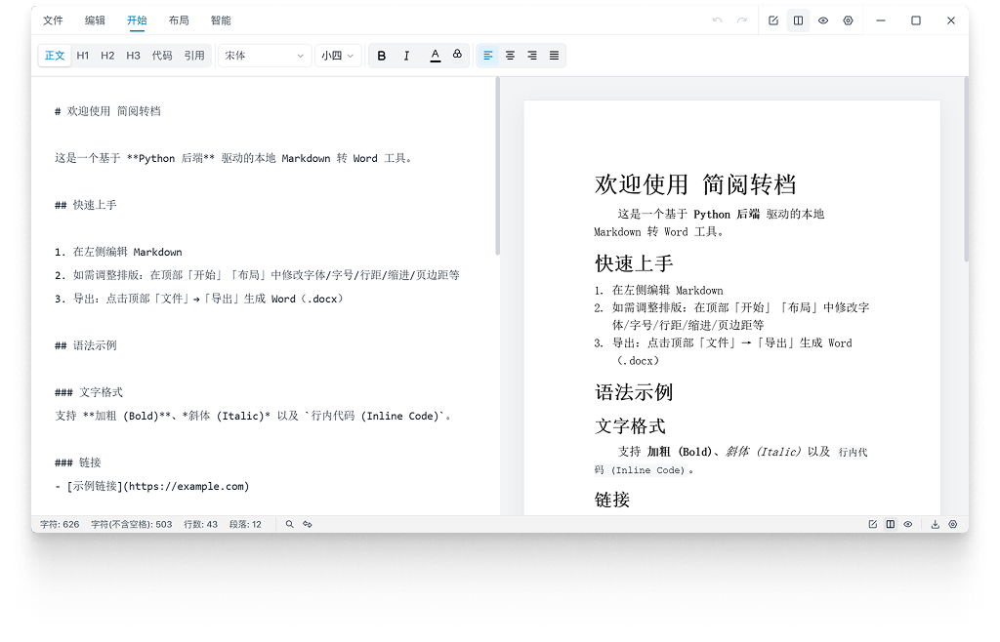
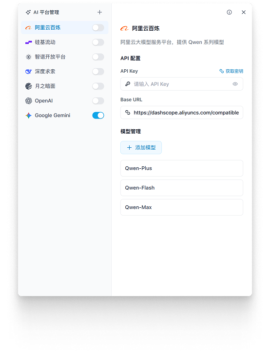

# 简阅转档

一个本地优先的 Markdown 转 Word 桌面应用。左边写 Markdown，右边实时看接近 Word 的排版效果，最后导出 `.docx`。

<div align="center">
  
  <p>
    <a href="https://tauri.app/"></a>
    <a href="https://react.dev/"></a>
    <a href="https://www.typescriptlang.org/"></a>
    <a href="https://vitejs.dev/"></a>
    <a href="https://python.org/"></a>
  </p>
</div>



## 它适合谁

如果你经常写 Markdown，但交付时必须给别人 Word 文档，这个工具就是为这种夹缝准备的。你不用一边写一边猜导出后会变成什么样，也不用把 Markdown 贴到各种在线转换网站里。

文档转换在本机完成。前端负责编辑、预览和样式配置，Python sidecar 负责生成 Word 文件。

## 主要功能

- 左侧 Markdown 编辑，右侧实时预览导出的 Word 排版。
- 支持 `.md`、`.markdown`、`.txt` 导入，导出 `.docx`。
- 可以调整正文、标题、代码、引用等样式，包括字体、字号、颜色、行距、缩进和页边距。
- 支持常见 Markdown 语法：标题、列表、表格、代码块、引用、链接等。
- 内置搜索、替换、视图切换、撤销/重做和底部状态栏。
- AI 样式生成可选开启，API Key 和模型配置保存在本地。

## AI 配置

AI 功能不是必需项。不配置也能正常编辑、预览和导出 Word。

配置窗口支持按平台启用模型、填写 API Key、调整 Base URL，并维护模型列表：



当前界面里预置了阿里云百炼、硅基流动、智谱开放平台、深度求索、月之暗面、OpenAI、Google Gemini 等平台，也可以按现有配置方式添加自定义模型。

## 快速开始

```bash
pnpm install
pnpm run dev:tauri
```

`pnpm run dev:tauri` 会启动 Vite 开发服务器，并打开 Tauri 桌面窗口。只调前端页面时，可以用：

```bash
pnpm run dev
```

## 环境要求

- Node.js 18+
- Rust 1.77.2+，用于 Tauri 开发和桌面端构建
- Python 3.10+，用于后端转换和打包
- PyInstaller，构建 Python sidecar 时需要
- Inno Setup，生成 Windows 安装包时需要，并确保 `iscc` 在 PATH 中

后端依赖安装：

```bash
pip install -r backend/requirements.txt
```

## 常用命令

```bash
# 前端开发
pnpm run dev

# 桌面端开发
pnpm run dev:tauri

# 前端构建
pnpm run build

# 桌面端构建
pnpm run build:tauri

# 构建 Python sidecar 到 src-tauri/binaries/
pnpm run build:backend

# 生成 Windows 安装包
pnpm run build:installer

# 检查
pnpm run lint
pnpm run typecheck
pnpm test
```

## Windows 打包流程

```bash
pnpm run build:backend
pnpm run build:tauri
pnpm run build:installer
```

安装包输出到：

```text
src-tauri/target/release/bundle/inno/
```

如果改了 `backend/` 里的转换逻辑，记得重新执行 `pnpm run build:backend`，把新的 sidecar 放进 `src-tauri/binaries/`。

## 项目结构

```text
src/                 React + TypeScript 前端
src/components/      编辑器、预览、顶部工具栏、设置窗口等 UI
src/features/        编辑器状态、搜索替换、导出、设置、AI 配置
backend/             Python Markdown -> Word 转换引擎
backend/converters/  表格、目录、样式、代码块等转换模块
backend/tests/       pytest + hypothesis 后端测试
src-tauri/           Tauri 桌面壳、权限配置、Rust 入口、sidecar 二进制
scripts/             打包和构建脚本
docs/screenshots/    README 使用的界面截图
test/                手工测试样例
```

## 后端转换

后端主入口在 `backend/converter.py`，它把 Markdown 解析结果交给不同 converter 处理：

- `table.py`：GFM 表格解析和 DOCX 表格渲染
- `toc.py`：目录生成
- `styles.py`：段落和字符样式注入
- `code_block.py`：代码块识别和渲染

运行后端测试：

```bash
python -m pytest backend/tests
```

## 许可证

MIT
